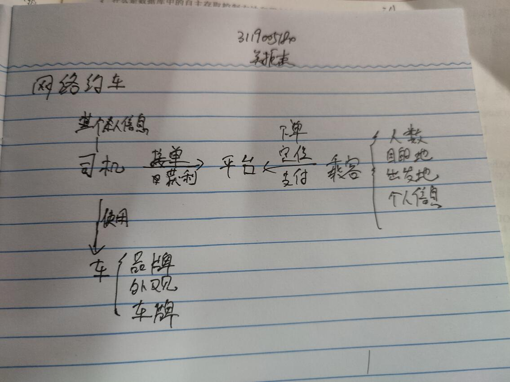
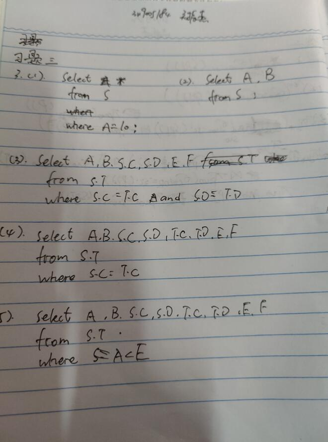
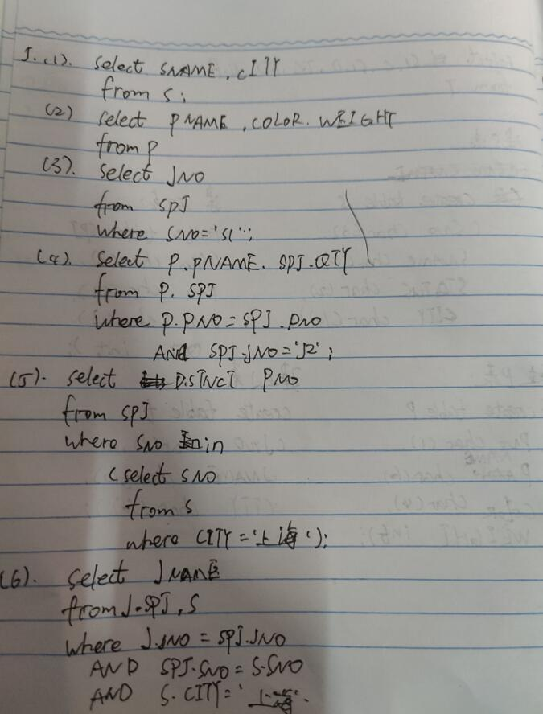
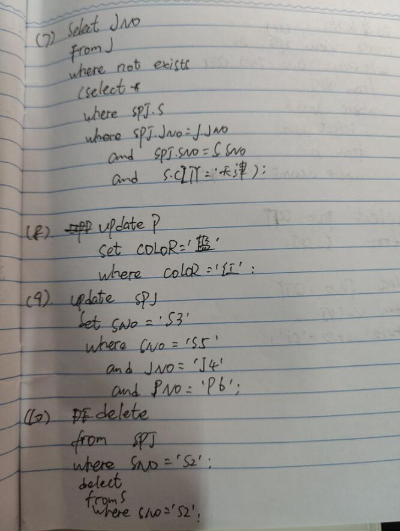
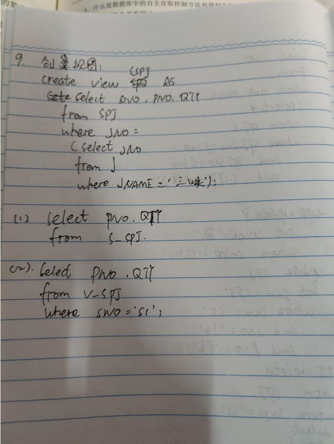
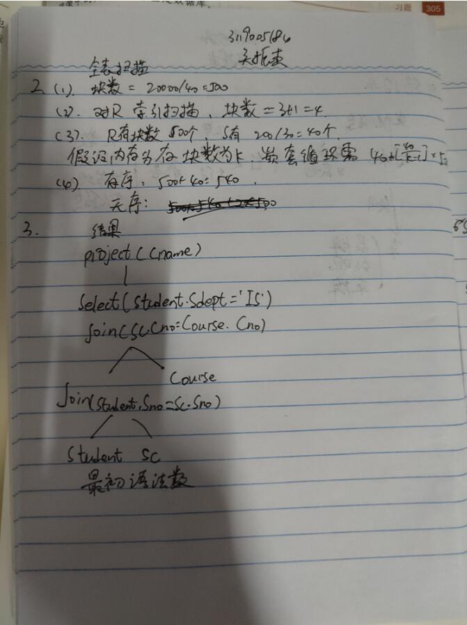
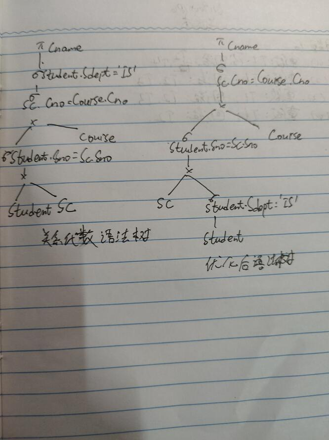
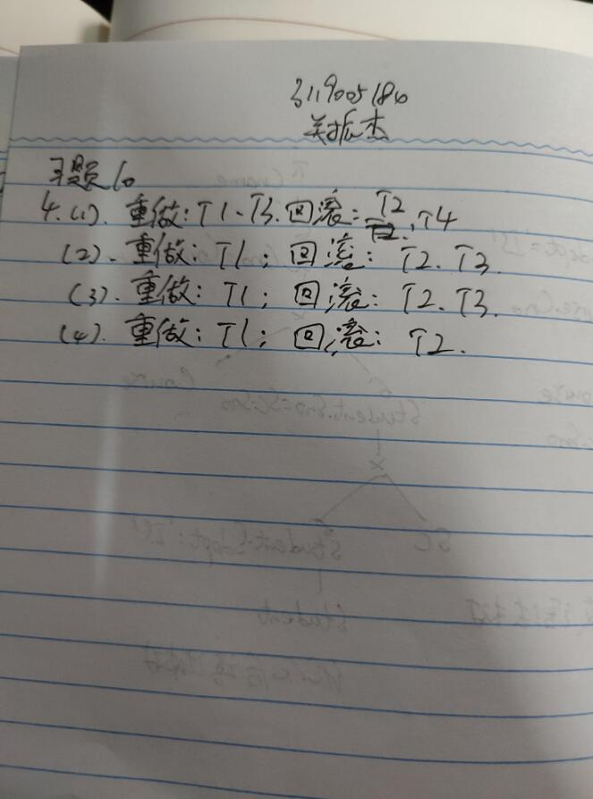

# db2
# 第一次作业
## 1.Mysql
MySQL是一个关系型数据库管理系统，由瑞典MySQL AB 公司开发，属于 Oracle 旗下产品。MySQL 是最流行的关系型数据库管理系统之一，在 WEB 应用方面，MySQL是最好的 RDBMS (Relational Database Management System，关系数据库管理系统) 应用软件之一。MySQL是一种关系型数据库管理系统，关系数据库将数据保存在不同的表中，而不是将所有数据放在一个大仓库内，这样就增加了速度并提高了灵活性。MySQL所使用的 SQL 语言是用于访问数据库的最常用标准化语言。MySQL 软件采用了双授权政策，分为社区版和商业版，由于其体积小、速度快、总体拥有成本低，尤其是开放源码这一特点，一般中小型网站的开发都选择 MySQL 作为网站数据库。

## 2.Archery
Archery 定位于 SQL 审核查询平台，旨在提升 DBA 的工作效率，支持多数据库的 SQL上线和查询，同时支持丰富的 MySQL 运维功能，所有功能都兼容手机端操作。

## 3.Percona Toolkit 工具包
Percona Toolkit 工具包是一组高级的管理 MySQL 的工具包集，可以用来执行各种通过手工执行非常复杂和麻烦的系统任务。简称 PT 工具，由 Percona 公司开发维护，是广大数据库维护人员的好帮手。

# 第二次作业
## 

# 第三次作业
## 

# 第四次作业
## 
## 
## 
## 
## 
## 

# 第五次作业
## 
## 

# 第六次作业
## 
## 
## 