# git 安装过程

## 1.下载
http://10.21.49.169/software/Git-2.28.0-64-bit.exe

## 2.安装
1).双击下载好的文件进入安装界面

2）进入安装界面，安装过程如下：
  
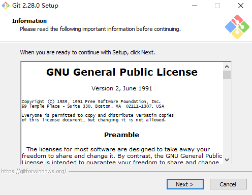

下一步点击next

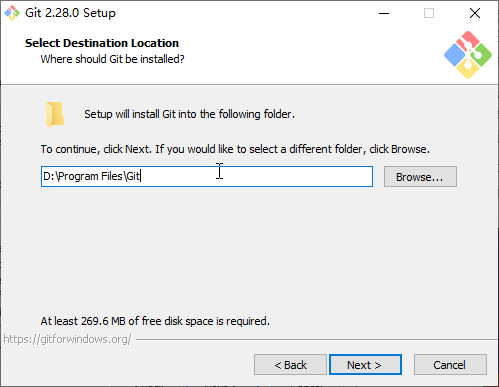

git保存的目录，可按喜好保存在想要的文件夹下，设置好后next

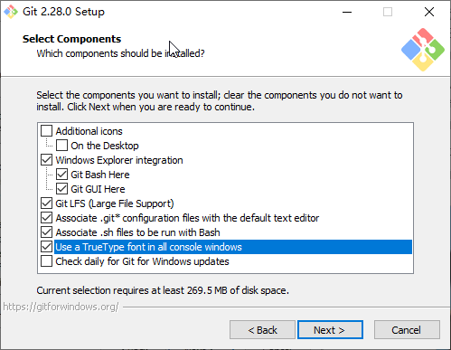

选择需要安装的内容，这里默认已经选好，直接next

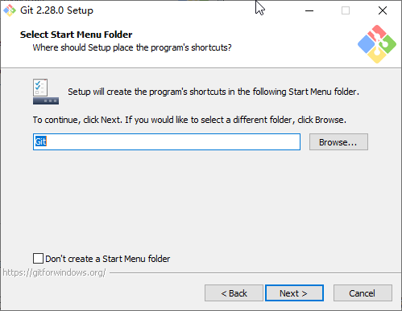

默认git文件夹，直接next

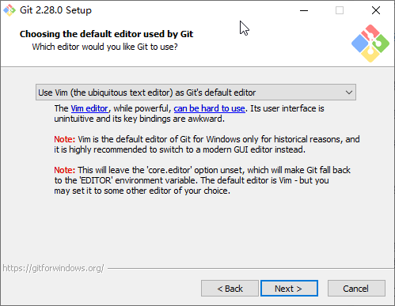

默认，直接next

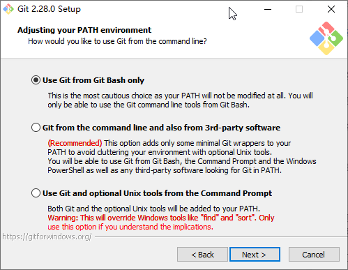

默认，直接next

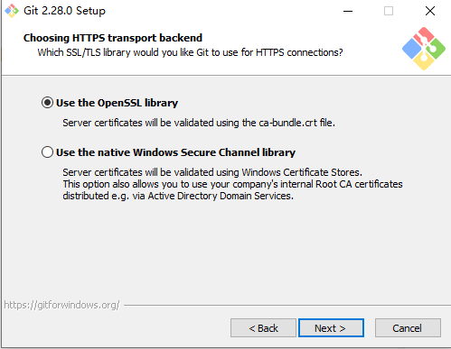

默认，直接next

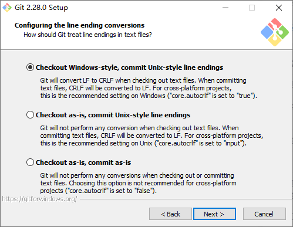

默认，直接next

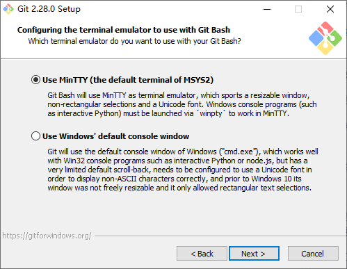

默认，直接next

选择第一个，然后next

选择第二个，然后next

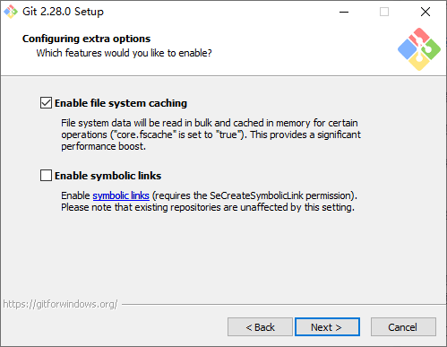

选择第一个，然后next

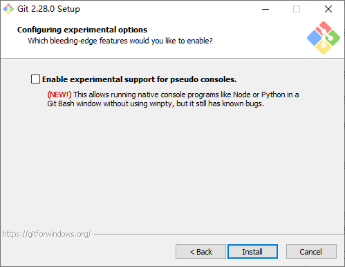

不选，直接next

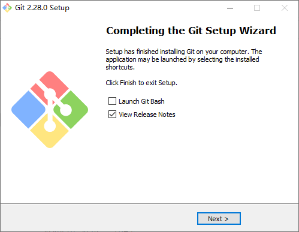

安装成功

## 3.配置

安装成功后需要配置才能使用。

配置具体教程如下：

https://10.21.49.169/cshao/git-gitlab-questions-and-answers/blob/master/doc/how-git-gitlab.md

## 4.实验总结

在下载git与安装git的过程中，由于选项一般都默认勾选好的，所以比较简单，不存在问题。

用git提交作业时的操作不太会，但跟着教程一步一步最后也成功提交。

通过本次实验，我学会了使用git，更是了解并学会使用了gitlab这一大平台。