# SQL语句练习

## 一、实验目的

学习并在mysql练习使用简单的SQL语句。

## 二、实验平台
win10  

mysql 8.0.21 解压版

## 三、实验内容
### 1.创建数据库(即定义模式)
输入create database student;student为数据库名

使用 show databases；查看有哪些数据库

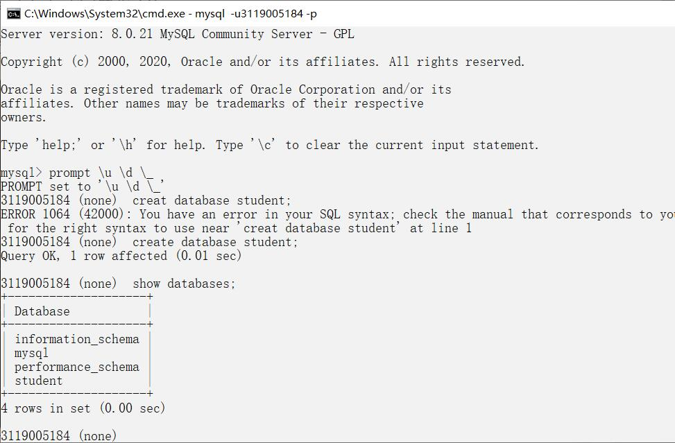

#### 删除数据库

输入drop database st; 删除数据库st：

### 2.创建表
输入 use student; 便可进入该数据库

随后创建表Student：

输入：

create table Student
(Sno char(20) primary key,
Sname char(20) unique,
Ssex char(2),
Sage smallint,
Sdept char(20)
);

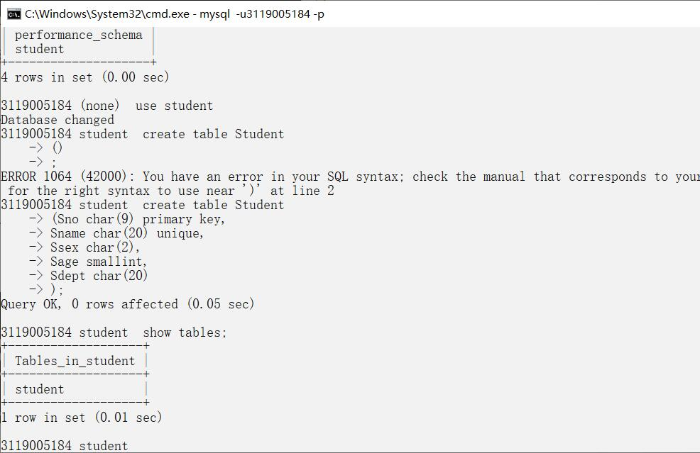

使用 

show tables; 和 describe Student; (使用use student进入数据库之后才能使用这个命令)

来查看刚建的表

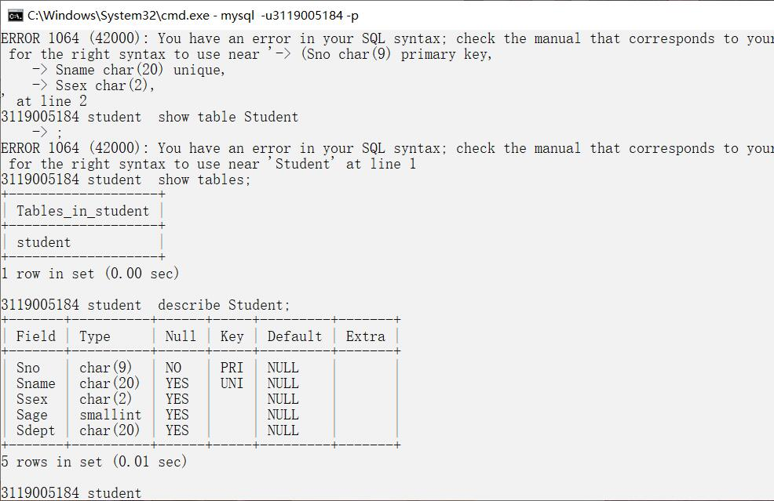

### 3.修改表

使用 alter 来进行修改表的操作。

#### 增加列：

使用add子句，例：

alter table student add S_entrance data;

向student表增加S_entrance列，类型为日期型。

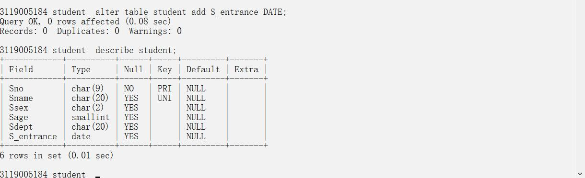

#### 删除列：

使用drop column子句，例：

alter table student drop column S_entrance;

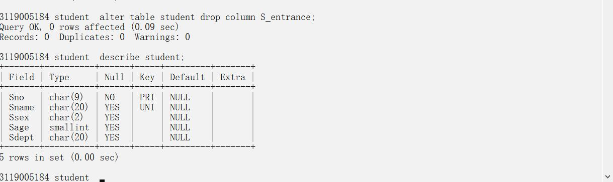

#### 修改原有的列定义

使用change子句，包括修改列名和数据类型,列：

alter table studnet change S_entrance Sentrance int;

S_entrance为旧名称，Sentrance为新名称，int为类型

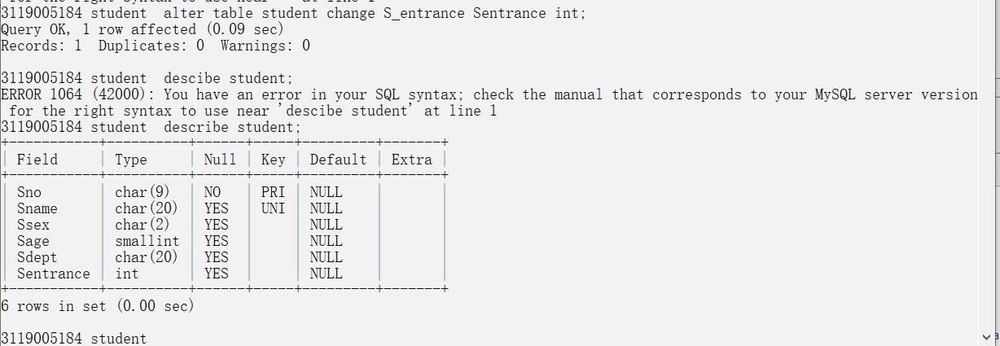

#### 修改表名

格式为 alter table 旧名字 rename to/as 新名字，例： 

alter table studnet2 rename to student;

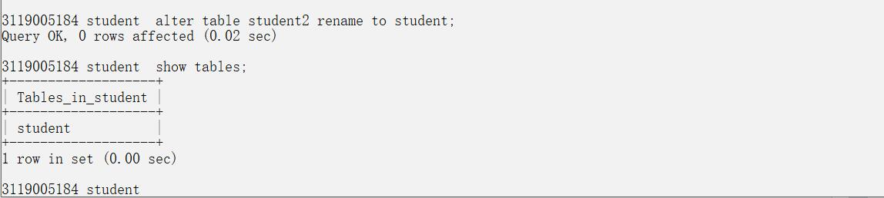

#### 删除表

drop table + 表名，列：

drop table student;

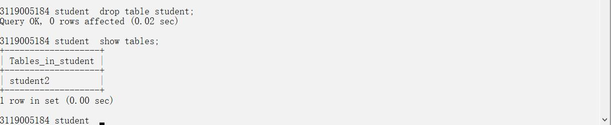

### 4.索引

#### 增加索引

create unique index ssno on student(Sno);

为student表创建索引，按学号升序建立唯一索引，默认为升序，降序在Sno 后面加desc；

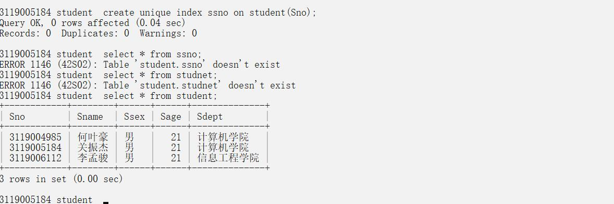

#### 更改索引名字

alter table student rename index ssno to Ssno;

ssno 为old name,Ssno 为 new name.

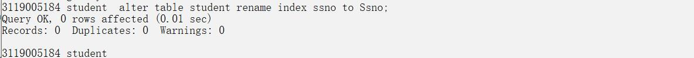

#### 删除索引

drop index ssno on student;

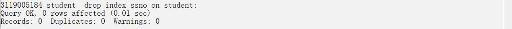

### 5.插入数据

使用insert来插入数据

格式为：insert into * values *

例：

insert into Student(Sno,Sname,Ssex,Sage,Sdept)values('5184','关振杰','男',21,'计算机学院');

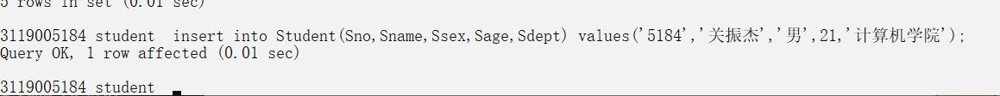

### 6.查找数据

使用select来查找数据

格式为 select * from *

例：

* select * from student; (查询全表)

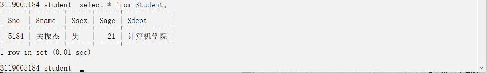

* select Sname from student;(查询姓名)

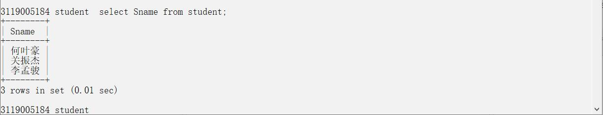

* select Sname,2021-Sage from student;(也可以是表达式)
 
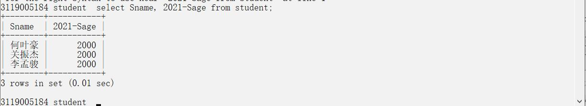

* select Sname,2021-Sage birthday from student;(直接改表达式的名称)

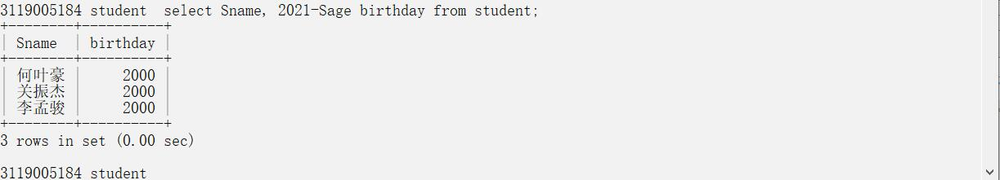

* select Sname,2021-Sage birthday,'Year',lower(Sdept) from student;(还能是字符串和函数)

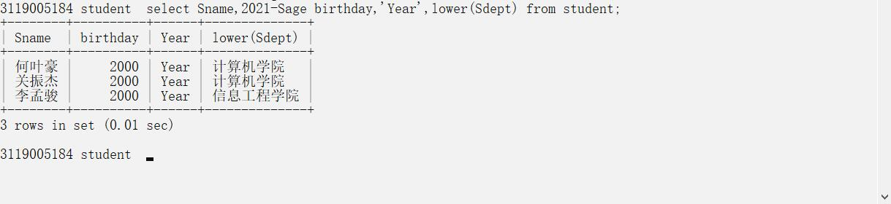

* select distinct Sno from student;  加入distinct可以使结果删除重复的行。

#### 使用where查询，查询的结果需要满足where里面的条件

* select Sname from student where Sdept = '计算机学院';

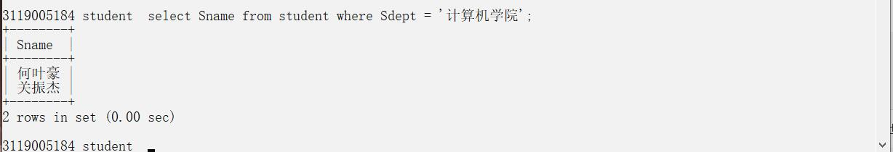

* select Sname ,Sdept from student where Sage between 20 and 30;

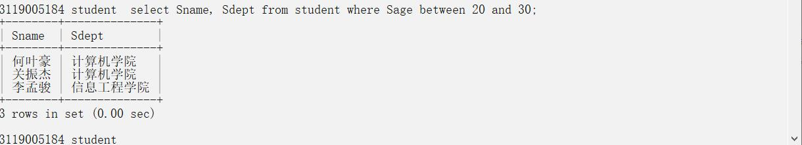

* select Sname,Sex from student where Sdept in ('计算机学院','信息工程学院');  (使用in)

* select Sname,Sno from student where Sname like '何叶豪'; (使用like，'何%'表示姓何的同学，还可以用not like)

*and和or可以用来连接多个查询条件

* select Sno,Sname from student where Sdept in ('计算机学院','信息工程学院') order by Sno; (order by,对一个或多个属性列做升序[asc]或降序[desc]排序，多个属性列用逗号分隔开)

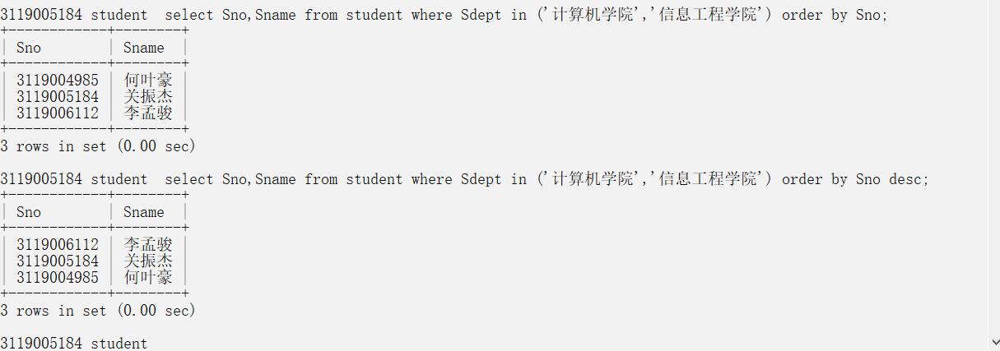

#### 聚集函数

* count(*)  统计元组个数

select count(*) from student;

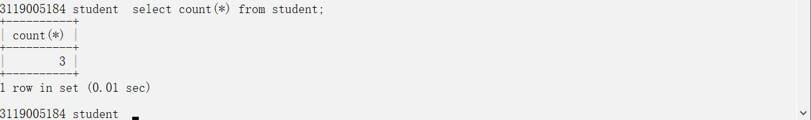

* count([distinct/all]<列名>) 统计一列中值的个数

select count(Sno) from student;

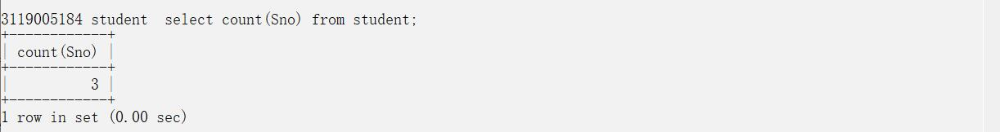
 
* sum([distinct/all]<列名>) 求一列和

* avg([distinct/all]<列名>) 求一列平均值

* max([distinct/all]<列名>) 求一列最大值

* min([distinct/all]<列名>) 求一列最小值

##### where后面不能用聚集函数

#### Group by 子句
* Group by 子句将查询结果按某一列或多列的值分组，值相等的为一组。

例，求各个课程号以及对应的选课人数：

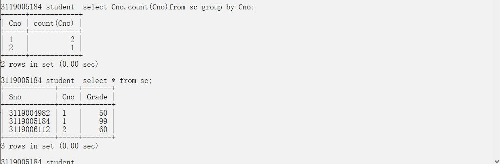

* having 后面加条件

例，求被学生选择1次以上的课程号：

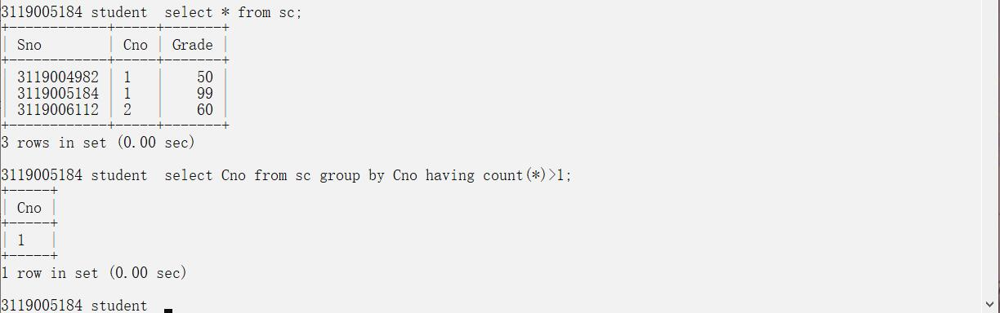

##### having子句能用聚集函数，而where不能

#### 连接查询

* 查询每个学生及其选修课情况：

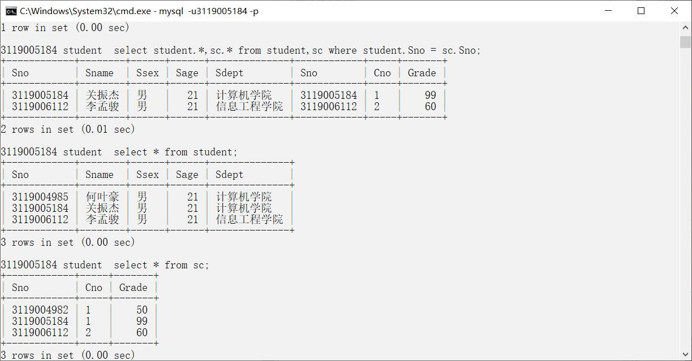

#### 嵌套查询

* 一个查询块嵌套在另一个查询块的where子句或having短语的条件中的查询

例，查询与我在同一系学习的学生：

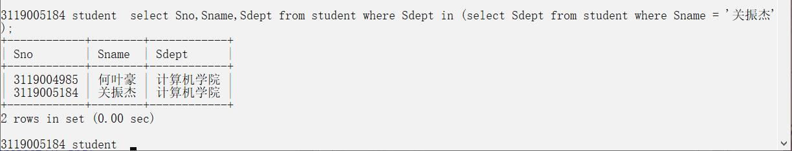

### 7.使用脚本建立数据库

由于直接在命令行中运行命令之后所输入的内容就会消失，因此如果需要修改数据的话，过程太过于繁琐，而运用脚本文件建立数据库，就能完美解决这个问题。

写好脚本文件之后，用：

 \\. 文件地址 

这个格式就能运行。

例：

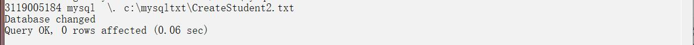

创建一个表

插入数据：

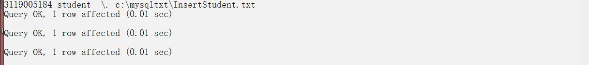

插入后展示数据：

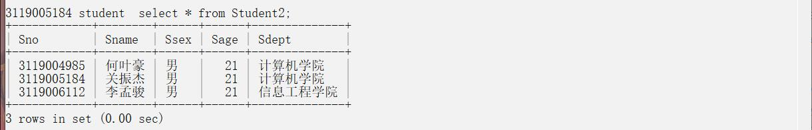

## 三、实验总结

这次实验需要实现课本第三章的内容，内容有点多，完成这次实验用了2周时间，用自己的双手以及一些自己的想法实现课本的例题，感觉收益匪浅，对数据库的基本语法熟悉了很多。