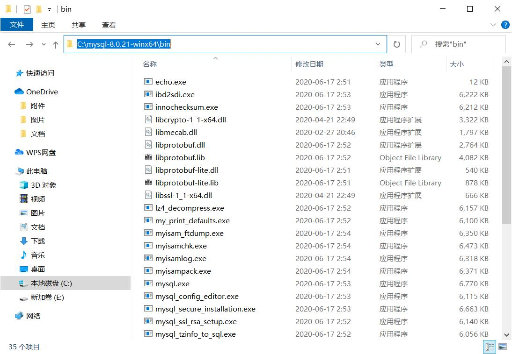
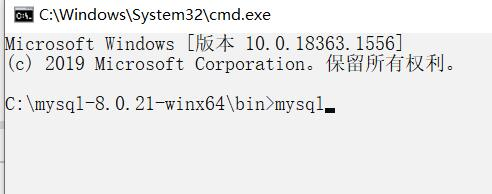
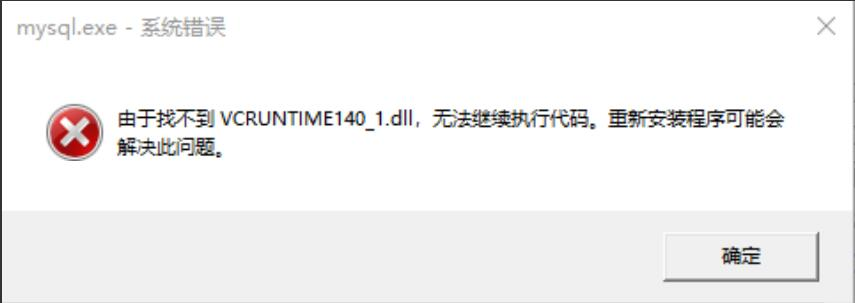
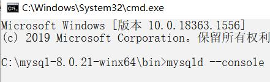
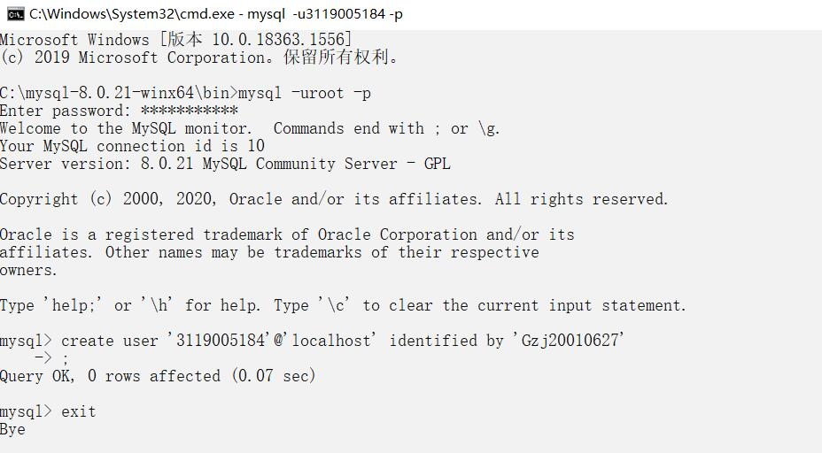
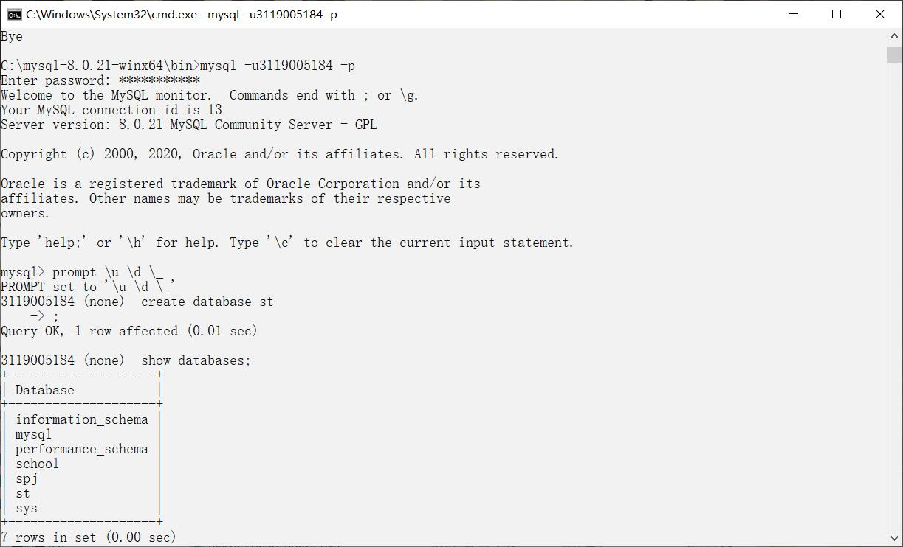
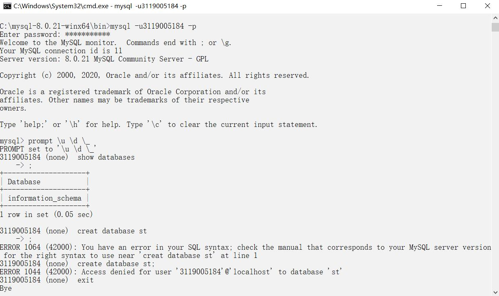
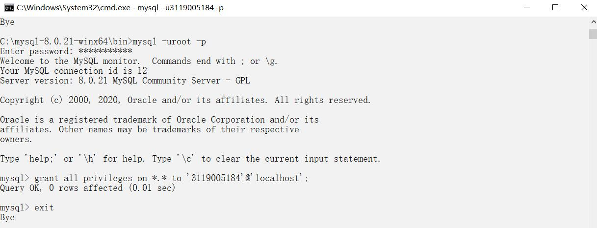

# mysql解压版安装
## 1.下载解压版文件并解压

mysql解压版下载地址：

http://10.21.49.169/software/mysql-8.0.21-winx64.zip

下载完之后，解压到想要的文件夹目录，然后找到该目录，进入里面的bin文件目录下，在文件路径下输入cmd进入该目录命令行

## 2.启动服务
输入mysql运行，启动mysql

如果出现这种情况：

可能是没有安装相应的 Microsoft Visual C++ 2015 Redistributable Package 安装包，安装即可。

随后输入mysqld --console，运行，启动mysqld

## 3.初始化数据库

输入mysqld --console --initialize，运行，初始化数据库，获得初始密码。该命令行窗口别关，随后另开一个命令行窗口，准备登录mysql。

## 4.登录mysql
我们要登录mysql数据库，需输入以下命令：

mysql -u root -p

随后输入刚刚得到的初始密码。

进入后，由于是初始化后第一次运行，所以系统提示必须修改密码

下面是修改密码语句：

alter user 'root'@'localhost' identified by '123123'

把密码改为123123。

随后便可退出重新登录，到此，数据库的功能便可使用

## 5.创建新用户
即把用户名改为学号，使用语句：

 create user '学号'@'localhost' identified by '密码'; 

来创建新用户

重新用新用户登录mysql，登录后输入：

prompt \u \d \_

便能出现用户名称。

如图为登录成功：

出现如下情况，是由于用户权限不足：

则我们要登录初始用户，来给新用户权限：

# 实验总结

由于上个学期已经安装了mysql的解压版，因此mysql的下载安装和初始化过程都是凭借记忆以及参考材料得出，mysql从安装到使用之间的过程看起来虽然十分繁琐，但一步一步来其实并不难。创建新用户是刚刚完成的过程，其实很简单，一句语句就能解决。

