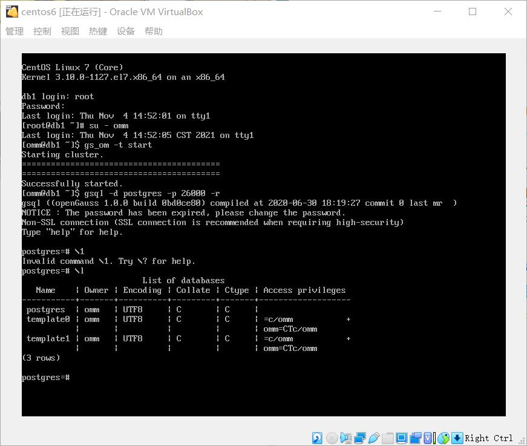

# openGauss实验
## 一、前期准备
### 1.openGuass.rar
校园网下载：http://10.21.49.169/software/openGuass.rar
### 2.Virtual Box 下载
https://download.virtualbox.org/virtualbox/6.1.16/VirtualBox-6.1.16-140961-Win.exe
## 二、平台镜像导入和启动，数据库启动
* 1. 解压资料下载章节所下载的文件openGuass.rar到某一目录，后面用~代表该资料解压目录。
* 2. 启动VirtualBox，选择菜单管理|导入，找到~\03实验指导书\镜像文件和安装包\centos2G+openGauss.ova,设置导入的目录。
* 3. 启动新导入的虚拟机centos6 输入root口令openGauss@123,登录操作系统。
### 启动数据库
* 输入su - omm，操作系统用户omm
* 输入命令gs_om -t start，启动数据库，如图启动成功：

* 连接数据库。执行命令gsql -d postgres -p 2600 -r
* 显示所有数据库,执行命令 \l

### 我出现的问题
由于我的电脑有Workstation虚拟机，就没有下载Virtual Box而直接使用Workstation;使用Workstation出现问题，启动数据库失败

### 问题解决
使用Virtual Box虚拟机就能解决问题

启动成功
## 三、创建用户和数据库
### 1.创建用户
执行SQL命令 create user u3119005184 with password "3119005184@abc"创建一个用户u3119005184

### 2.创建数据库
执行SQL命令 create database sc owner u3119005184,为我创建一个sc数据库

创建完数据库后，可以执行下面命令\q退出 当前数据库连接，然后使用先建立的用户连接数据库。
## 四、在openGauss下完成sql操作
### 以自己所创建的用户连接数据库，执行命令：
gsal -d sc -U u3119005184 -W "3119005184@abc" -p 26000 -r

### 修改用户名作为提示符

### 给用户所有权限
grant all privilege to u3119005184

### 创建student表

出现create table，创建成功

### 插入数据(增)
* 使用语句：insert into tablename()values();  来插入数据。

* 一次性插入多组数据：

### 更新数据(改)

使用update来更新数据

### 查找数据(查)

使用select关键字来查找表中数据

### 删除数据(删)
* 使用delete关键字来删除表中数据，
删除行：

* 使用drop关键字来删除整个表：

删除成功
### 模式schema
#### 模式的作用：通过管理schema，允许多个用户使用同一数据库而不相互干扰，可以将数据库对象组织成易于管理的逻辑组，同时便于将第三方应用添加到相应的schema下而不引起冲突。
* 创建schema:

create schema myschema;

后面加关键词authorization,指定为一个用户创建模式

* 使用schema:
在特定schema下创建对象或者访问特定schema下的对象，需要使用有schema修饰的对象名。该名称包含schema名以及对象名，他们之用“.”号分开。

执行如下命令在myschema下创建mytable表:

查询schema下的表：

* 删除schema
当schema为空时，即该schema下没有数据库对象，使用DROP SCHEMA命
令进行删除。例如：

当schema非空时，如果要删除一个schema及其包含的所有对象，需要使用
CASCADE关键字。例如：

## 五、实验总结
使用openguess来实现数据库操作大致上与使用MySQL相同，sql语句只有少许差别，因此很快能上手。

