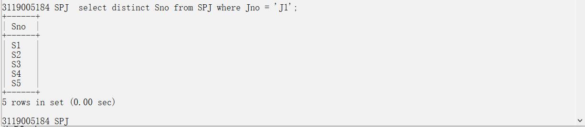
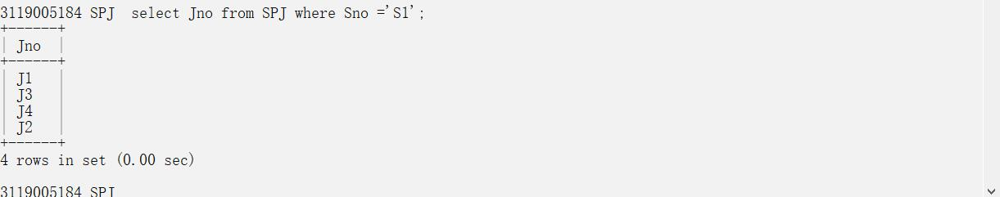

# 实验内容
## 第三章习题
### 第4题
#### S表

#### P表

#### J表

#### SPJ表

#### (1)求供应程J1零件的供应商号码SNO:

#### (2) 求供应工程 J 1 零件 P1 的供应商号码 SNO:

#### (3) 求供应工程 J 1 零件为红色的供应商号码 SNO;

#### (4) 求没有使用天津供应商生产的红色零件的工程号 JNO；
select distinct Jno from SPJ where Jno not in(select distinct Jno from SPJ where Sno in (select Sno from S where City = '天津')and Pno in (select Pno from P where Color = '红'));

#### (5) 求至少用了供应商 S1 所供应的全部零件的工程号 JNO
先找出供应商S1所有的供应零件

然后再查找都供应商为S1并且使用这些零件的工程号

### 第5题
#### (1)找出所有供应商的姓名和所在城市：

#### (2) 找出所有零件的名称、 颜色、 重量：

#### (3) 找出使用供应商 S1 所供应零件的工程号码：

#### (4) 找出工程项目 J2 使用的各种零件的名称及其数量：

#### (5) 找出上海厂商供应的所有零件号码：

#### (6) 找出使用上海产的零件的工程名称：

#### (7) 找出没有使用天津产的零件的工程号码：

#### (8) 把全部红色零件的颜色改成蓝色：

#### (9) 由 S5 供给 J4 的零件 P6 改为由 S3 供应：

### 第9题
#### (1)找出三建工程项目的各种零件代码及其使用情况

#### (2)找出供应商S1的供应情况

