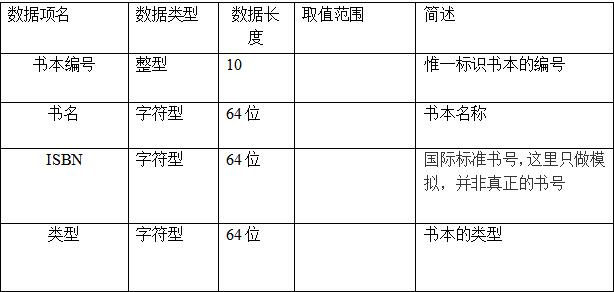
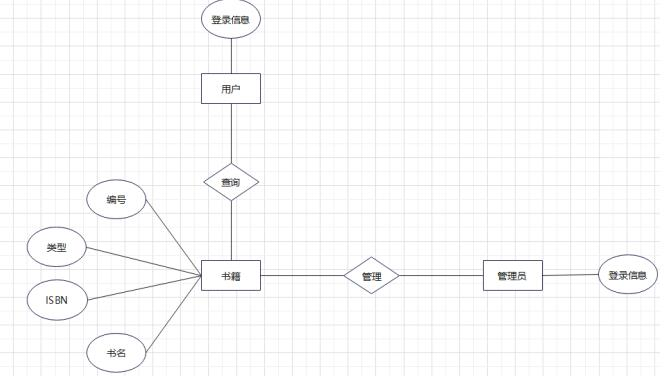
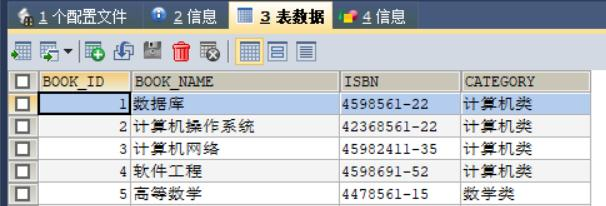

# 课程设计
## 题目名称：图书管理系统
### 1.系统描述
(1)功能描述：图书馆的在线管理系统，登记图书、查询图书、删除图书、修改图书。
(2)具体描述：
1.登记图书，输入图书编号，名称，ISBN编号以及图书类型。
2.查询图书信息，显示其详细信息。
3.删除图书，通过输入图书名或图书编号亦或者ISBN编号。
4.在图书列表中修改某一本书的信息。
### 2.相关技术介绍
* Java:
是由Sun公司推出的Java面向对象程序设计语言和Java平台的总称。由James Gosling和同事们共同研发，并在1995年正式推出。Java最初被称为Oak，是1991年为消费类电子产品的嵌入式芯片而设计的。1995年更名为Java，并重新设计用于开发Internet应用程序。用Java实现的HotJava浏览器（支持Java applet）显示了Java的魅力：跨平台、动态Web、Internet计算。从此，Java被广泛接受并推动了Web的迅速发展，常用的浏览器均支持Javaapplet。另一方面，Java技术也不断更新。Java自面世后就非常流行，发展迅速，对C++语言形成有力冲击。在全球云计算和移动互联网的产业环境下，Java更具备了显著优势和广阔前景。

* servlet:
是在服务器上运行的小程序。这个词是在 Java applet的环境中创造的，Java applet 是一种当作单独文件跟网页一起发送的小程序，它通常用于在客户端运行，结果得到为用户进行运算或者根据用户互作用定位图形等服务。

* JSP:
中文名叫java服务器页面，其根本是一个简化的Servlet设计，是由Sun 公司倡导、许多公司参与一起建立的一种动态网页技术标准。JSP技术有点类似ASP技术，它是在传统的网页HTML（标准通用标记语言的子集）文件(*.htm,*.html)中插入Java程序段(Scriptlet)和JSP标记(tag)，从而形成JSP文件，后缀名为(*.jsp)。 用JSP开发的Web应用是跨平台的，既能在Linux下运行，也能在其他操作系统上运行。
它实现了Html语法中的java扩张。JSP与Servlet一样，是在服务器端执行的。通常返回给客户端的就是一个HTML文本，因此客户端只要有浏览器就能浏览。

* JDBC:
java数据库连接,是一种用于执行SQL语句的Java API，可以为多种关系数据库提供统一访问，它由一组用Java语言编写的类和接口组成。JDBC提供了一种基准，据此可以构建更高级的工具和接口，使数据库开发人员能够编写数据库应用程序.

* Tomcat 服务器:
是一个免费的开放源代码的Web 应用服务器，属于轻量级应用服务器，在中小型系统和并发访问用户不是很多的场合下被普遍使用，是开发和调试JSP 程序的首选。可以这样认为，当在一台机器上配置好Apache 服务器，可利用它响应HTML页面的访问请求。实际上Tomcat 部分是Apache 服务器的扩展，但它是独立运行的，所以当你运行tomcat 时，它实际上作为一个与Apache 独立的进程单独运行的。

* 数据库mysql：
是一个关系型数据库管理系统，由瑞典 MySQL AB 公司开发，目前属于 Oracle 旗下公司。MySQL 最流行的关系型数据库管理系统，在 WEB 应用方面 MySQL 是最好的 RDBMS (Relational Database Management System，关系数据库管理系统) 应用软件之一。MySQL 是一种关联数据库管理系统，关联数据库将数据保存在不同的表中，而不是将所有数据放在一个大仓库内，这样就增加了速度并提高了灵活性。MySQL 所使用的 SQL 语言是用于访问数据库的最常用标准化语言。MySQL 软件采用了双授权政策（本词条“授权政策”），它分为社区版和商业版，由于其体积小、速度快、总体拥有成本低，尤其是开放源码这一特点，一般中小型网站的开发都选择 MySQL 作为网站数据库。由于其社区版的性能卓越，搭配 PHP 和 Apache 可组成良好的开发环境。

* 集成开发环境 MyEclipse
是在Eclipse 基础上加上自己的插件开发而成的功能强大的企业级集成开发环境，主要用于Java、Java EE以及移动应用的开发。在最新版本的MyEclipse中，配合CodeMix使用支持也十分广泛，尤其是对各种开源产品和主流开发框架的支持相当不错。已支持PHP、Python、Vue、Angular、React、Java、Java EE等语言和框架开发。

* 集成开发环境idea：
是一个十分优秀的用于开发Java, J2EE的 Eclipse 插件集合，MyEclipse的功能非常强大，支持也十分广泛，尤其是对各种开源产品的支持十分不错。MyEclipse可以支持Java Servlet，AJAX，JSP，JSF，Struts，Spring，Hibernate，EJB3，JDBC数据库链接工具等多项功能。可以说MyEclipse是几乎囊括了目前所有主流开源产品的专属eclipse开发工具。
### 3.需求分析
* 系统的业务需求是：系统的业务需求是：使图书管理工作规范化，系统化，程序化，避免图书管理的随意性，提高信息处理的速度和准确性，能够及时、准确、有效的查询和修改图书情况分析

* 分析：在线管理图书信息，那么一定要有对图书信息存储数据库的访问，插入信息，删除信息，修改信息等功能，且这些功能之间同步且不会互相冲突，以此可以获取对应的用户需求

* 用户需求
1.查询信息图书，且可以从根据图书编号，名称，ISBN编号和图书类型查询某一本书。
2.根据书本类型查找感兴趣的书，或查看所有书籍的视图
3:添加一个新的图书，手动输入图书编号，名称，ISBN编号以及图书类型。
4:查看所有已储存到数据库中的图书，显示其详细信息。
5:在图书列表中修改某一本书的信息。
* 数据字典

### 4.概念结构设计
* E—R图

### 5.逻辑结构设计
* 根据需求进行概要设计，
系统逻辑结构可以分成五个模块
1.服务模块
2.查找模块
3.删除模块
4.修改模块
5.创建模块

* 从上述模块要求，可以得出以下优化结构：
分页工具类 PageBean
图书实体类 Book
接口 BookDao，规定需要实现的功能，
BookDao 接口的实现类 BookDaoImpl，
BookService 接口，规定需要实现的业务，
BookService 接口的实现类 BookServiceImpl，
BookManager 类，在控制台使用图书管理系统的功能，
BookServlet，对整体业务进行控制

* 本系统用到的视图代码如下:

public interface BookDao {
    List<Book> selectAll() throws SQLException;

    void add(Book var1) throws SQLException;

    void update(Book var1) throws SQLException;

    void delete(Book var1) throws SQLException;

    List<Book> blurryName(Book var1) throws SQLException;

    Book bookInfo(Book var1) throws SQLException;

    List<Book> selectAll(int var1, int var2) throws SQLException;
} 

### 6.数据库物理设计
* 系统配置
系统开发平台: jsp + mysql + idea+tomcat8.5，
系统运行环境: Windows 10，
使用到的辅助工具：sqlyog x64
* 存储位置：
   本地

### 7.数据库实施
#### 数据库及数据库对象
* 数据库信息:

* 关键编码如下：

连接数据库：
public class DBUtil {
    private static final String URL;
    private static final String USERNAME;
    private static final String PASSWORD;
    private static final String DRIVER;
private static ResourceBundle rb = ResourceBundle.getBundle("com.jmp.util.db-config");

    private DBUtil() {     }

    public static Connection getConnection() {
        Connection con = null;

        try {
            con = DriverManager.getConnection(URL, USERNAME, PASSWORD);
        } catch (SQLException var2) {
            var2.printStackTrace();
            System.out.println("数据库连接失败，请检查数据库地址、用户名、密码是否存在错误！！！");
        }

        return con;  }

    public static void close(ResultSet rs, Statement stat, Connection con) throws SQLException {
        if (rs != null) {
            rs.close();  }

        if (stat != null) {
            rs.close();}

        if (con != null) {
            rs.close();  }

        System.out.println("数据库连接已关闭！");   }

    public static void main(String[] args) {
        System.out.println(getConnection());   }

    static {
        URL = rb.getString("jdbc.url");
        USERNAME = rb.getString("jdbc.username");
        PASSWORD = rb.getString("jdbc.password");
        DRIVER = rb.getString("jdbc.driver");

        try {
            Class.forName(DRIVER);
        } catch (ClassNotFoundException var1) {
            var1.printStackTrace();  }}}

服务：
public class BookServlet extends HttpServlet {
    BookService bookService = new BookServiceImpl();
    PageBean pb = new PageBean();
    int pageUp;
    int pageDown;

    public BookServlet() {
        this.pageUp = this.pb.getPage();
        this.pageDown = this.pb.getPage();    }
    protected void doPost(HttpServletRequest request, HttpServletResponse response) throws ServletException, IOException {
        this.doGet(request, response);  }

    protected void doGet(HttpServletRequest request, HttpServletResponse response) throws ServletException, IOException {
        String m = request.getParameter("m");
        if ("add".equals(m)) {
            this.add(request, response);
        } else if ("update".equals(m)) {
            this.update(request, response);
        } else if ("delete".equals(m)) {
            this.delete(request, response);
        } else if ("selectAll".equals(m)) {
            this.selectAll(request, response);
        } else if ("bookInfo".equals(m)) {
            this.bookInfo(request, response);
        } else if ("blurryname".equals(m)) {
            this.bookBlurryName(request, response);       }   }

    private void add(HttpServletRequest request, HttpServletResponse response) throws ServletException, IOException {
        String bookName = request.getParameter("book_name");
        String isbn = request.getParameter("isbn");
        String category = request.getParameter("category");
        Book book = new Book(0, bookName, isbn, category);
        System.out.println(book.toString());

        try {
            this.bookService.add(book);
            this.selectAll(request, response);
        } catch (SQLException var8) {
            var8.printStackTrace();       }    }

    private void update(HttpServletRequest request, HttpServletResponse response) throws ServletException, IOException {
        String bookId = request.getParameter("book_id");
        String bookName = request.getParameter("book_name");
        String isbn = request.getParameter("isbn");
        String category = request.getParameter("category");
        Book book = new Book(Integer.parseInt(bookId), bookName, isbn, category);

        try {
            this.bookService.update(book);
            this.selectAll(request, response);
        } catch (SQLException var9) {
            var9.printStackTrace();      }}

    private void delete(HttpServletRequest request, HttpServletResponse response) throws ServletException, IOException {
        String bookId = request.getParameter("book_id");
        Book book = new Book();
        book.setBook_id(Integer.parseInt(bookId));

        try {
            this.bookService.delete(book);
            this.selectAll(request, response);
        } catch (SQLException var6) {
            var6.printStackTrace();   } }

    private void selectAll(HttpServletRequest request, HttpServletResponse response) throws ServletException, IOException {
        List booklist;
        if ("pageUp".equals(request.getParameter("pageUp"))) {
            System.out.println(request.getParameter("pageUp"));
            this.pb.setPage(this.pb.getPage() - 1);
            if (this.pb.getPage() < 1) {
                this.pb.setPage(1);
            }

            try {
                booklist = this.bookService.selectAll(this.pb.getPage(), 5);
                request.setAttribute("bookList", booklist);
                request.getRequestDispatcher("/views/booklist.jsp").forward(request, response);
            } catch (SQLException var6) {
                var6.printStackTrace();
            }
        } else if ("pageDown".equals(request.getParameter("pageDown"))) {
            System.out.println(request.getParameter("pageDown"));
            this.pb.setPage(this.pb.getPage() + 1);

            try {
                booklist = this.bookService.selectAll(this.pb.getPage(), 5);
                request.setAttribute("bookList", booklist);
                if ("".equals(booklist)) {
                    request.setAttribute("null_err", "<h3>查询内容为空请返回上一页</h3>");
                }

                request.getRequestDispatcher("/views/booklist.jsp").forward(request, response);
            } catch (SQLException var5) {
                var5.printStackTrace();
            }
        } else {
            this.pb.setPage(1);

            try {
                booklist = this.bookService.selectAll(this.pb.getPage(), 5);
                request.setAttribute("bookList", booklist);
                request.getRequestDispatcher("/views/booklist.jsp").forward(request, response);
            } catch (SQLException var4) {
                var4.printStackTrace();  }  }  }

    private void bookInfo(HttpServletRequest request, HttpServletResponse response) throws ServletException, IOException {
        String bookId = request.getParameter("book_id");
        Book book = new Book();
        book.setBook_id(Integer.parseInt(bookId));

        try {
            Book b = this.bookService.bookInfo(book);
            request.setAttribute("b", b);
        } catch (SQLException var6) {
            var6.printStackTrace(); }
        request.getRequestDispatcher("/views/updatebook.jsp").forward(request, response);   }

    private void bookBlurryName(HttpServletRequest request, HttpServletResponse response) throws ServletException, IOException {
        String keyName = request.getParameter("blurryname");
        Book book = new Book();
        book.setBook_name(keyName);

        try {
            List<Book> bookblurryList = this.bookService.blurryName(book);
            request.setAttribute("bookblurryList", bookblurryList);
            request.getRequestDispatcher("/views/blurrynamebook.jsp").forward(request, response);
        } catch (SQLException var6) {
            var6.printStackTrace(); }}}
### 8.附录
数据库表：

create database book;
use book;

CREATE TABLE `book`  (
  `BOOK_ID` int(50) NOT NULL AUTO_INCREMENT,
  `BOOK_NAME` varchar(100)  NOT NULL,
  `ISBN` varchar(100),
  `CATEGORY` varchar(100),
  PRIMARY KEY (`BOOK_ID`)
) ENGINE=InnoDB DEFAULT CHARSET=utf8;

INSERT INTO book VALUES(NULL,'数据库','4598561-22','计算机类');
INSERT INTO book VALUES(NULL,'计算机操作系统','42368561-22','计算机类');
INSERT INTO book VALUES(NULL,'计算机网络','45982411-35','计算机类');
INSERT INTO book VALUES(NULL,'软件工程','4598691-52','计算机类');
INSERT INTO book VALUES(NULL,'高等数学','4478561-15','数学类');

### 参考文献
* 数据库系统概论
* 面向对象软件工程
* 软件工程
* javaweb基础